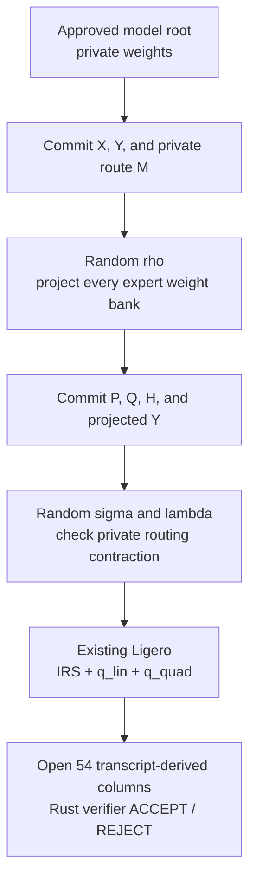

# VerInf RoutedProjected-MoE

## Active-route, zero-knowledge Ligero proofs for 400B mixture-of-experts inference

VerInf proves statements about private large-model inference using transparent,
hash-based commitments over the Goldilocks field. This branch introduces
**RoutedProjected-MoE**, a protocol for proving top-1 mixture-of-experts (MoE)
layers without materializing proof witnesses for all experts.

The central optimization is simple to state:

> Compute and commit only the expert activation selected for each token, while
> using random projections to bind that active computation to every enrolled
> expert weight matrix.

The protocol is not a replacement for Ligero. It is an algebraic reduction
*inside* Ligero: all new values are ordinary Ligero witness rows, all relations
are discharged by the existing IRS, linear, quadratic, Merkle, and Rust
verifier checks, and the same zero-knowledge padding discipline is retained.

> [!IMPORTANT]
> This implementation does **not** use GKR, private sorting, or a new polynomial
> commitment scheme. Earlier design notes explored a layer-local GKR hybrid;
> that is not the protocol implemented or benchmarked here. See
> [RoutedProjected protocol](analysis/routed-projected-protocol.md) for the
> normative construction and [implementation status](analysis/routed-projected-status.md)
> for the only authoritative completion ledger.

> [!NOTE]
> **Status: end-to-end complete.** On 2026-08-06 this protocol produced a
> 400B/1000-token proof in **2 h 02 min** that an independent Rust verifier
> **ACCEPTed** in **1 h 51 min**, with a fail-closed admission report measured
> on the same machine. Numbers and artifact digests are in
> [§12](#12-measured-end-to-end-result).

---

## Abstract

A direct Ligero proof of top-1 MoE inference can be wasteful: although the
forward computation selects one expert per token, a naive proof witness
materializes intermediate outputs for all `E` experts and only then proves that
the routing mask selects one of them. For Llama 4 Maverick at `E = 128`, this
all-expert witness dominates the online proof.

RoutedProjected-MoE replaces that witness with a three-epoch randomized
reduction. After the base inputs, outputs, and private one-hot routes are
committed, the verifier samples an output projection `rho`. The prover commits
projected expert weights, routed projected values, and one Hadamard product.
A second challenge, sampled only after those commitments, verifies the private
routing contraction with a two-sided Freivalds check. Every equality is then
compiled into the existing joint Ligero linear and quadratic tests.

For the 1000-token, 48-layer Maverick workload, the conservative online ledger
falls from

```text
W/L/Q = 888,249,981,888 / 162,237,276,010 / 173,106,423,296
```

to

```text
W/L/Q =  95,205,646,976 /  31,064,630,194 /  42,394,577,408.
```

This removes inactive-expert activations, not model authentication: all expert
weights remain bound to a trusted persistent commitment and participate in the
random projection.

---

## One picture



The intuitive comparison is:

- **Classic all-expert Ligero:** seal a huge accounting book containing the
  outputs of all 128 experts, then prove that the private route selected one.
- **RoutedProjected-MoE:** seal the route and the selected output, then attach a
  randomized receipt that binds it to the complete enrolled expert bank.

There is no point at which the prover is allowed to choose the receipt after
seeing the challenge that will test it.

---

## 1. What ordinary Ligero proves

Ligero arranges committed field values as message rows, applies a Reed–Solomon
encoding, and Merkle-commits the resulting columns. VerInf compiles model
semantics into a joint system of linear and quadratic constraints over those
rows.

For a conventional matrix multiplication `Y = XW`, the witness includes the
relevant values of `X`, `W`, and `Y`, together with projection, rescaling,
range, and lookup auxiliaries. Across the model, Ligero checks four properties:

1. **Binding.** Merkle roots fix the committed rows before later challenges.
2. **Proximity.** IRS checks that committed rows behave as Reed–Solomon
   codewords of the required degree.
3. **Constraint soundness.** `q_lin` and `q_quad` fold all linear and
   multiplication constraints into a small number of test polynomials.
4. **Zero knowledge.** Secret padding and dedicated blinding rows hide the
   information exposed by the opened columns.

After the roots and test polynomials are fixed, the verifier derives a random
set of columns. A false low-degree relation disagrees on many columns, so a
prover that committed first cannot arrange for every error to land outside the
queried set.


The difficulty is not verifier sampling. The prover must still generate,
encode, fold, or reopen the underlying witness rows. In the original Maverick
layout, ordinary weights and all-expert MoE activations produced a witness near
`9e11` field slots.

---

## 2. The MoE relation we need to prove

For `T` tokens, `E` experts, input width `K`, and output width `J`, let

- `X[t,k]` be the input activation;
- `M[t,e]` be the private top-1 routing matrix;
- `W[e,k,j]` be the enrolled expert weights;
- `Y[t,j]` be the claimed routed output.

The target relation is

$$
Y_{t,j}=\sum_{e=0}^{E-1}\sum_{k=0}^{K-1}
M_{t,e}X_{t,k}W_{e,k,j}.
$$

`RoutingClaim` separately proves that each row of `M` is the unique top-1
route under the model's exact score, range, tie-breaking, and dominance rules.
Thus each token has exactly one active expert, but neither the expert identity
nor its multiplicity is public.

The honest implementation evaluates only

$$
Y_{t,j}=\sum_k X_{t,k}W_{e_t,k,j},
$$

where `e_t` is the committed private route. It never constructs `T x E x J`
expert outputs.

---

## 3. First projection: bind the output to all expert weights

The prover first commits `X`, `Y`, and `M`. Only then does the transcript derive
a random vector

$$
\rho\in\mathbb F^J.
$$

The prover computes and commits

$$
P_{e,k}=\sum_j W_{e,k,j}\rho_j,
$$

$$
Q_{t,k}=\sum_e M_{t,e}P_{e,k},
$$

$$
H_{t,k}=X_{t,k}Q_{t,k},
\qquad
y^\rho_t=\sum_jY_{t,j}\rho_j.
$$

Existing Ligero relations enforce

$$
P=W\rho,\qquad H=X\odot Q,\qquad
y^\rho=Y\rho,\qquad \sum_kH_{t,k}=y^\rho_t.
$$

This is where the optimization keeps full model binding. The prover computes
only selected expert *activations*, but `P = W rho` reads and projects every
expert's enrolled weights. Substituting another expert bank or inventing `P`
creates a false Ligero linear relation against the trusted weight root.

The projection reduces the expensive output dimension `J` to one field value
per `(expert,input)` pair. Its storage over all Maverick routed matmuls is
56,623,104 fields, about 453 MB, and it is cached under the digest of `rho` for
the lifetime of the proof.

---

## 4. Second projection: prove private route selection

The remaining relation is

$$Q=MP.$$

Both `M` and `P` are private and `P` depends on the first challenge, so their
product cannot be safely compressed with randomness known before `Q` is
committed. After the `P,Q,H,y^rho` commitment, the transcript derives fresh

$$
\sigma\in\mathbb F^K,
\qquad
\lambda\in\mathbb F^T.
$$

The prover commits

$$
f_y[e]=\sum_kP[e,k]\sigma_k,
$$

$$
f_u[e]=\sum_t\lambda_tM[t,e],
\qquad
f_p[e]=f_u[e]f_y[e].
$$

Ligero checks the Hadamard products and the final equality

$$
\sum_e f_p[e]
=
\sum_{t,k}\lambda_tQ[t,k]\sigma_k.
$$

If `Q != MP`, the two-sided random contraction rejects except with probability
at most approximately `2/|F|`. No route, per-expert token count, or expert
activation is revealed.

---

## 5. Transcript order

Commit-before-challenge is load-bearing. The exact sequential transcript is:

```mermaid
sequenceDiagram
    participant P as Prover
    participant V as Verifier / FS transcript
    P->>V: R1: base, output, route, blind roots; reference trusted W root
    V-->>P: s_op, deriving rho
    P->>V: R2: commit P, Q, H, y^rho
    V-->>P: s_bind, deriving sigma and lambda
    P->>V: R3: commit f_y, f_u, f_p
    V-->>P: s_comb
    P->>V: q_irs, q_lin, p_0
    V-->>P: s_col, deriving 54 distinct columns
    P->>V: opened columns and Merkle paths
```

Fiat–Shamir hashes the canonical statement, ordered block labels, roots, and
every preceding prover message. The verifier recomputes every challenge; seeds
serialized in a proof are checked for agreement and never trusted.

The block order is part of the statement:

```text
blind | W | p1 | p2 | p3
```

The Rust verifier receives the expected model root and statement digest from
outside the proof. Missing policy is a rejection, not a development fallback.

---

## 6. Why the security of Ligero is preserved

RoutedProjected-MoE does not ask an external protocol to authenticate Ligero
values. It expresses the complete reduction as ordinary variables and
constraints in the same joint Ligero argument.

Assume:

1. the enrolled weight root is trusted and its rows passed enrollment checks;
2. Merkle binding and BLAKE3 collision resistance hold;
3. IRS binds the opened rows to the required RS degree;
4. `RoutingClaim` soundly proves the unique top-1 route;
5. every transcript challenge is sampled after its preceding commitment.

Then:

- a false projected output survives the random `rho` contraction with
  probability at most `1/|F|`;
- a false private routing contraction survives `lambda,sigma` with probability
  at most `2/|F|`;
- false `P = W rho`, Hadamard, rescale, range, and lookup relations incur the
  existing Ligero linear/quadratic/LogUp error terms;
- malformed committed rows incur the existing IRS/proximity error;
- changing the model or statement requires breaking the external root/digest
  policy or the commitment.

Consequently, the new contribution is bounded by

$$
\epsilon_{RP}
\le
\epsilon_{Ligero}
+\frac{3}{|\mathbb F|}
+\epsilon_{hash}.
$$

At the production geometry (`ELL=8192`, `K=16384`, `N=65536`, 54 columns), the
field terms are far below the conservative proximity budget. A 48-instance
union bound gives

$$
48\left(\frac34\right)^{54}\approx 8.6\times10^{-6},
$$

which is below the earlier 40-column profile

$$
\left(\frac34\right)^{40}\approx 1.0\times10^{-5}.
$$

See [the protocol note](analysis/routed-projected-protocol.md) and the negative
tests in `prover/tests/test_routed_projected.py` for the executable statement.

---

## 7. Zero knowledge

The route, activations, projections, reciprocals, and auxiliary vectors are
witness values. They are not serialized as plaintext proof fields.

Zero knowledge is inherited from the existing Ligero masking discipline:

- `p1`, `p2`, and `p3` use fresh secret entropy for each proof;
- test polynomials use independent structured blinding rows;
- the persistent weight commitment has a private enrollment seed;
- all queried columns are derived after the roots and test polynomials;
- the verifier sees only masked RS column evaluations and public transcript
  messages.

Persistent commitments require lifecycle accounting. Repeated proofs against
the same weight root expose a cumulative set of distinct column evaluations
under the same padding. The private enrollment handle therefore records every
opened weight column and refuses to exceed

$$
\frac{K-ELL}{2}=4096
$$

distinct columns at the production geometry — about 75 proofs of 54 columns,
before overlap. The remedy is a refresh under a fresh seed with a Ligero
equality proof linking the old and new roots.

The ledger is security state:

- one prover holds an exclusive enrollment lock;
- the updated ledger is atomically saved and fsynced before a proof is
  published;
- a failed publication may spend columns conservatively, but cannot publish
  unrecorded leakage.

The measured run in §12 booked **54 of the 4096** columns available to its
enrollment, which the prover reported and persisted before the proof was
published.

---

## 8. What changed relative to classic VerInf Ligero

| Component | All-expert baseline | RoutedProjected-MoE |
|---|---|---|
| Expert weights | Ordinary online witness plus commitment | One-time persistent commitment; referenced online |
| Expert activations | Materialize all `E` outputs | Materialize only the selected output per token |
| Route proof | One-hot/top-1 constraints | Same `RoutingClaim`; unchanged |
| Matmul binding | Per-expert outputs and Freivalds auxiliaries | `rho` weight projection plus late `lambda,sigma` contraction |
| Constraint backend | Ligero IRS / linear / quadratic | The same Ligero backend |
| Transcript | Three coins expanded from one base seed | Four coins, each hashed from the transcript so far |
| Witness epochs | Four | Five (`p3` carries the late auxiliaries) |
| Proof transport | Decimal JSON | `u64le`/base64 in the same JSON envelope |
| New PCS or trusted setup | None | None |
| Route visibility | Hidden | Hidden |
| Weight visibility | Hidden | Hidden, subject to opening ledger |

The optimization deletes inactive-expert witness work. It does **not** make
proof cost sublinear in model size: every enrolled expert weight still
participates in `P = W rho` and in the persistent Ligero fold/opening path.

---

## 9. What this is not: comparison with GKR

GKR and sumcheck reduce a layered arithmetic circuit to evaluations at random
multilinear points. A possible hybrid would use GKR inside each transformer
layer and a polynomial commitment only at layer boundaries. That is an
interesting future direction, but it requires an additional recursive
soundness and zero-knowledge compiler, terminal-opening machinery, and exact
lookup integration.

RoutedProjected-MoE takes a narrower route:

| Question | GKR hybrid | This implementation |
|---|---|---|
| Internal layer proof | Tensor sumcheck | Existing Ligero constraints |
| Layer-by-layer roots | Required | No; one global claim tape/transcript |
| Terminal PCS bridge | Required | No new bridge |
| Private MoE mechanism | Circuit/sumcheck dependent | Two committed projections inside Ligero |
| Main engineering change | New proof backend | New claim and witness layout |

The benefit is auditability: the Rust verifier compiles the new claim into the
same packet families and checks it with the same primitives already used by
the baseline. The Rust side of this protocol is 411 changed lines against a
3,553-line verifier; there is no second proof system to trust.

---

## 10. Lookup, rounding, and the rest of the model

Only the expert matmul proof is replaced. The exact model statement remains
the VerInf statement:

- GGUF/model manifest and enrolled roots;
- quantized integer arithmetic;
- signed-floor rescaling via standalone `RescaleClaim`;
- range constraints;
- SiLU, softmax, and RMSNorm lookup/algebraic gadgets;
- top-1 routing and tie-breaking;
- attention, residuals, embedding, final RMSNorm, and LM head;
- committed token streams and the public unexplained-information claim.

Lookup challenge order remains commit-before-challenge. RoutedProjected-MoE
does not introduce a dynamic private lookup table or change LogUp.

---

## 11. Cost ledger

At `S=1000`, with 24 MoE layers and three routed expert matrices per layer,

$$
N=24\cdot1000\cdot(2\cdot5120+8192)=442{,}368{,}000,
$$

$$
R=24\cdot128\cdot(2\cdot5120+8192)=56{,}623{,}104.
$$

The routed claim contributes

$$
W_{route}=943{,}718{,}400,
\quad
L_{route}=56{,}785{,}608,
\quad
Q_{route}=442{,}377{,}216.
$$

After removing the ordinary 400B weight witness, all-expert outputs, and their
old auxiliaries while retaining selected outputs and exact rescaling:

| Ledger | Baseline | RoutedProjected | Ratio |
|---|---:|---:|---:|
| Witness slots `W` | 888,249,981,888 | 95,205,646,976 | 10.72% |
| Linear occurrences `L` | 162,237,276,010 | 31,064,630,194 | 19.15% |
| Quadratic products `Q` | 173,106,423,296 | 42,394,577,408 | 24.49% |

### A note on linear-test accounting

`q_lin` has two physically different costs:

1. **row/witness-side work**, charged per committed slot inside
   `fresh_commit_fold` and `persistent_weight_qlin`;
2. **constraint-side coefficient work**, charged per linear occurrence `L`.

They must be measured separately. Removing the second term would undercount;
charging a complete `q_lin` pass to both terms would double-count. Both errors
were made and caught during bring-up: `fresh_commit_fold` was initially timed
on the encode alone, understating its row-side body by 35%, and an early
mapping charged the whole fold to the constraint side.

Measurement settled it at approximately 3.56 ns per linear occurrence, i.e.
114 s for the constraint-side pass, so the envelope is

$$
12{,}957.864 - 25.6 + 114
=13{,}046.264\text{ s}
=3.624\text{ h}.
$$

The stage caps are now **computed** from
`analysis/routed_projected_4h_model.py` rather than copied into the gate, after
a copy was found drifting: the gate had kept `proof_egress = 879.63 s` while
the model had moved to `481.48 s` with the compact wire.

---

## 12. Measured end-to-end result

### Established baseline

The original all-expert VerInf prover produced an independently accepted
40-column proof for a 1093-token, 48-layer 400B Maverick run on a DGX Spark:
**prove 69,390.0 s = 19.27 h**, verify **50,302,708 ms = 13.97 h** at T=30 of
40 opened columns
([archive](analysis/full-model-sound-run-archive.md)). That result establishes
the baseline Ligero system.

### RoutedProjected production run, 2026-08-06

Rented A100-SXM4-80GB, real GGUF `UD-Q4_K_XL`, 48 layers, `E=128`, `S=1000`
(442 prompt + 558 continuation), `T_QUERIES=54`, 2,596 claims.

| Phase | Result |
|---|---:|
| Model download (217 GB) | ~13 min |
| Smoke, 4 layers | 3 min |
| Witness-only pass at production geometry | 5.5 min |
| One-time enrollment, 49,160,720 weight rows | 26 min |
| Admission report (714-run campaign + warm sweep) | 9.5 min |
| **Prove** | **7,352.9 s = 2 h 02 min** |
| Peak GPU during prove | 65.11 GB (69.91 GB unified) |
| Proof serialization | 47.2 s, 35.46 GB, `u64le`/base64 |
| **Independent Rust verification** | **6,661,444 ms = 1 h 51 min, 30 threads** |
| Verdict | **`rust_verify: ACCEPT`** |

Admission passed with every stage measured on the machine that ran the proof —
no stage null, no random weights, no borrowed report:

| Stage | Measured bound | Cap |
|---|---:|---:|
| model_load | 62.8 | 400 |
| semantic_5_active_sweeps | 2,023.8 | 3,609 |
| fresh_commit_fold | 596.2 | 950 |
| linear | 89.2 | 114 |
| quadratic | 682.2 | 765 |
| fresh_hash_coef | 103.9 | 140 |
| persistent_weight_qlin | 2,401.2 | 3,624.5 |
| persistent_open | 54.5 | 1,812.3 |
| fresh_open | 13.5 | 450 |
| proof_egress | 212.5 | 481.5 |
| rtt / tail / orchestration | 80 / 20 / 600 | same |
| **Total** | **6,939.8** | **14,400** |

All ten verifier checks passed, including the four that make this a policy
check rather than a self-check:

```text
[OK] merkle          [OK] statement_digest = H(claim bytes, block order)
[OK] irs_col         [OK] statement_digest = trusted policy digest
[OK] lin_sum         [OK] seeds in file = recomputed transcript
[OK] lin_col         [OK] weight root = trusted enrolled root
[OK] quad_zero
[OK] quad_col
```

`lin_col` covered 66,077,399 rows and `quad_col` 5,412,064 quadratic
constraints. Artifact identity:

```text
enrolled root     e300bc0789427af7cc35f67ccf426afc15fa3ea569336ae72eb106ac2bf6f507
statement digest  83335ea6019cfbcb788bdccf5a61133f668d1ab2f0253858521f2f74f77b2141
public Sz         32865524  = 20.7454 bits/token over 558 continuation positions
```

### How to read the comparison

Against the all-expert baseline this is roughly **9.4x** on prove and **7.6x**
on verify. That is *not* a controlled A/B: the card differs (A100-SXM4-80GB vs
DGX Spark GB10), the column count differs (54 vs 40, i.e. the new run is
strictly the stronger soundness profile), and the context differs (1000 vs
1093 tokens). Treat it as two end-to-end system results, not as a measured
speedup of one variable.

Two numbers in the table are **not** measurements of what they resemble:

- the 47.2 s serialization implies 751 MB/s, well above the 200–315 MB/s the
  egress benchmark sees; the box had 129 GB of RAM and most of that write
  landed in page cache;
- verification time is not priced by the admission model at all and lies
  outside the prover SLO.

The model's own accuracy is worth recording: the prove came in **6.0% above**
the sum of its measured stages, that difference being orchestration nobody had
measured separately, and the proof file was 35.46 GB against 36.45 GB derived
from the layout.

---

## 13. Repository map

| Path | Purpose |
|---|---|
| `analysis/routed-projected-status.md` | Only authority on implemented/passed stages |
| `analysis/routed-projected-protocol.md` | Normative protocol and security reduction |
| `analysis/routed_projected_4h_model.py` | Operation ledger and four-hour envelope |
| `demo/4h-production-runbook.md` | Fail-closed production procedure |
| `prover/routed_projected.py` | Python claim, witnesses, samplers, constraints |
| `prover/rescale_claim.py` | Exact post-matmul signed-floor rescaling |
| `demo/moe_routed.py` | Active-only MoE builder |
| `verifier/src/handlers.rs` | Independent Rust constraint compiler |
| `verifier/src/fs.rs` | Sequential Fiat–Shamir transcript |
| `prover/admission.py` | Source/model/machine/layout-bound startup gate |
| `analysis/bench/admission_bench.py` | Production-geometry kernel rates |
| `analysis/bench/make_admission_report.py` | Complete report, model stages included |
| `analysis/bench/s5b_remote.sh` | The whole rented chain, cheap steps first |
| `prover/tests/test_routed_projected.py` | Honest and malicious claim tests |
| `prover/tests/test_pipeline_integration.py` | Enrollment → proof → Rust verification gate |
| `prover/tests/difftest_lde_skip.py` | Byte-identical proof under the unread-LDE skip |

---

## 14. Reproducing the protocol gates

Install the Python environment and build the independent verifier:

```bash
uv sync
cd verifier
cargo build --release
cargo test --release --bin verify_proof
cd ../prover
```

Run the load-bearing gates:

```bash
python tests/run_tests.py test_fiat_shamir
python tests/run_tests.py test_phase3_block
python tests/run_tests.py test_routed_projected
python tests/run_tests.py test_rescale_claim
python tests/run_tests.py test_moe_routed
python tests/run_tests.py test_shard_streaming
python tests/run_tests.py test_opening_ledger
python tests/run_tests.py test_quad_eval_accumulator
python tests/run_tests.py test_admission_gate
python tests/run_tests.py test_pipeline_integration
```

Important negative cases include:

- fabricated routed output;
- output computed by the wrong expert;
- committed `P` inconsistent with `W rho`;
- modified transcript challenges;
- missing external model/statement policy;
- tampered phase-3 columns;
- exhausted persistent-opening budget;
- optimized quadratic accumulator differing from the literal polynomial;
- report from another source tree, GPU, filesystem, model, or row layout;
- a kernel stage relabelled to dodge the 714-run statistical requirement.

---

## 15. Production outline

The full commands and operational checks live in
[the production runbook](demo/4h-production-runbook.md). In outline:

1. enroll the exact GGUF weights once and record the trusted root;
2. build the exact claim tape and static statement digest;
3. collect a complete admission report on the same source, model, machine,
   row layout, and proof filesystem;
4. reserve proof space and lock the enrollment handle;
5. run the five-epoch prover;
6. atomically save the opening ledger before publishing the compact proof;
7. verify with the independent Rust binary and externally supplied root and
   statement digest.

The target geometry is fixed:

```text
ELL=8192, K_DEG=16384, N_LIG=65536, T_QUERIES=54
```

The driver refuses to silently substitute a cheaper development geometry,
random weights, a stale performance report, another filesystem, or missing
policy values.

### On admission statistics

Two classes of stage cannot share one statistical rule, and the report says
which it used:

- **repeatable** kernel stages carry a distribution-free simultaneous p99
  bound: the observed maximum of `n` runs, with `0.99^n <= 0.01/13` giving
  `n >= 714`. Their measurement body runs in milliseconds, so this is cheap;
- **single-shot** stages (`model_load`, the semantic sweeps, and the
  operational allowances) are measured by *running* them and bounded by
  `1.25 x` the observed maximum. Demanding 714 samples of a 3,609 s stage
  would be ~30 GPU-days per stage, and consecutive runs on one rented box are
  not independent anyway.

The second is a **margin, not a confidence interval**. A report must declare
`bound_kind` and list exactly the single-shot set, so a kernel cannot be
relabelled into the weaker class and no reader can mistake the file for a
uniform p99 claim.

---

## 16. Security map

| Attack | Defense |
|---|---|
| Substitute another model | Trusted manifest and persistent weight root |
| Change a value after seeing randomness | Sequential commit-before-challenge transcript |
| Commit arbitrary non-codewords | Ligero IRS/proximity test |
| Fabricate `P = W rho` | Existing Ligero linear test against enrolled `W` |
| Fabricate the routed output | `rho` output projection plus Ligero constraints |
| Use a different private route in `Q` | Late `lambda,sigma` Freivalds contraction |
| Use a non-top-1 route | Existing `RoutingClaim` |
| Forge a multiplication | Existing `q_quad` / `p_0` test |
| Forge a lookup or rescale | Existing LogUp, range, and `RescaleClaim` constraints |
| Choose convenient columns | Sequential Fiat–Shamir derives them after test polynomials |
| Recover routes or activations | Fresh secret RS padding and blinding rows |
| Accumulate weight leakage across proofs | Persistent opening ledger and refresh proof |
| Race two proofs against one ledger | Exclusive enrollment lock and durable update-before-publish |
| Authorize a run with a convenient benchmark | Report bound to source digest, model root, statement, machine, filesystem, row manifest |

---

## 17. Limitations

- This is a research prototype, not a completed external security audit.
- The end-to-end result in §12 is **one** run on **one** rented machine. It has
  not been reproduced, and the single-shot stages of its admission report carry
  a margin rather than a confidence interval.
- The token set for that run was synthetic (a seeded pseudo-random id stream),
  so it exercises the full protocol and cost, but the statement it proves is
  not about a served conversation.
- The model is still read at least once for the random projection; the protocol
  removes inactive activations, not dependence on total parameter count.
- Proofs remain large. Compact `u64le/base64` transport reduces formatting and
  storage overhead but does not change the number of opened field elements.
- Verification cost is real and unpriced: 1 h 51 min on 30 threads for the run
  above, against a prove of 2 h 02 min. No stage cap governs it.
- Persistent zero knowledge is stateful: losing or rolling back the private
  opening ledger can invalidate its leakage accounting.
- Fiat–Shamir security is stated in the random-oracle model; an interactive
  deployment may instead use verifier randomness with the same message order.
- External anchoring of hidden committed token streams to an independently
  recorded serving transcript remains separate work.

---

## 18. How to cite this artifact

Until a paper identifier is assigned, use a repository citation that pins the
commit and protocol version:

```bibtex
@misc{verinf-routed-projected-2026,
  title        = {RoutedProjected-MoE: Active-Route Ligero Proofs for
                  400B Mixture-of-Experts Inference},
  author       = {VerInf Contributors},
  year         = {2026},
  howpublished = {Research software artifact},
  note         = {Protocol and implementation; cite the exact Git commit}
}
```

For a paper, the core reusable claim is:

> A private top-1 routed matmul can be reduced to an output projection and a
> late two-sided routing contraction, with all auxiliary values committed in
> causal order and discharged by an existing Ligero linear/quadratic argument.
> This removes inactive-expert activation witnesses while preserving model
> binding, route privacy, transparent setup, and the original verifier backend.

---

## References

- Scott Ames, Carmit Hazay, Yuval Ishai, and Muthuramakrishnan Venkitasubramaniam.
  *Ligero: Lightweight Sublinear Arguments Without a Trusted Setup*. CCS 2017.
- Rūsiņš Freivalds. *Fast Probabilistic Algorithms*. MFCS 1979.
- Shafi Goldwasser, Yael Tauman Kalai, and Guy N. Rothblum. *Delegating
  Computation: Interactive Proofs for Muggles*. STOC 2008. Included for
  comparison; GKR is not used by this implementation.

---

## License and responsible use

Use the repository license and deployment policy applicable to the containing
VerInf project. Reproduce security claims only with the exact transcript,
geometry, trusted-root policy, padding ledger, and negative tests described
above; changing any of those creates a different protocol.
