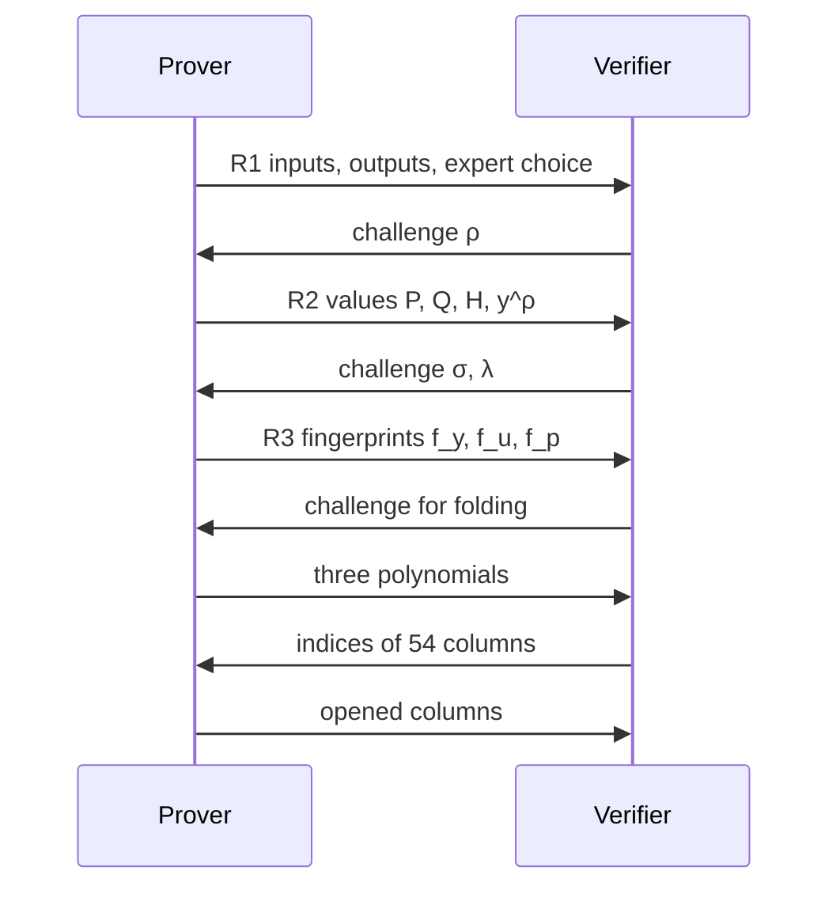

# VerInf: the current algorithm and its advantage over Ligero

The current version of VerInf proves a run of a 400-billion-parameter model with 100 tokens in 31.5 min on a single B200, and in 16.5 min with the weight bridge. At 1000 tokens it fits in 2 h 02 min on an A100, against 19.3 h for the previous version. The new expert-checking protocol (RoutedProjected-MoE) shrinks the table of secret values by a factor of 9.3.

## The task

One party runs a language model. The other party wants to make sure the answer was computed by exactly this model. At the same time, the first party does not want to show the model weights or the tokens themselves.

VerInf solves this with a zero-knowledge proof. That is the name for a proof from which the verifier learns only one thing: the statement is true. It learns nothing else.

The task has two roles. The prover runs the model and builds the proof. The verifier receives the proof and either accepts or rejects it.

The only public number in the proof is an upper bound on the unexplained information. This is the number of bits in each output token that the model does not explain. In the full Llama 4 Maverick run it is 0.880 bits per token, so the model explains about 95% of the information in the output.

Two notions are needed below:

- **Witness.** All numbers the prover knows and hides: the weights, the intermediate values of every layer, the choice of experts, the tokens.
- **Commitment.** A short fingerprint (a hash) that firmly fixes the witness but reveals nothing about it. After sending a commitment the prover can no longer swap the numbers.

## Classic Ligero

Classic Ligero (Ames et al., 2017) checks a computation written as a circuit of additions and multiplications. It is simple, needs no trusted setup and relies only on a hash function.

### How it works

1. **Table.** All witness numbers are laid out in the rows of a table. In VerInf a row holds 8192 numbers.
2. **Row stretching.** Every row is encoded with a Reed-Solomon code. This stretches the row by a factor of 4 so that forging even a single number corrupts a large share of the columns of the stretched table.
3. **Commitment.** The columns of the stretched table are hashed into a Merkle tree. A Merkle tree folds hashes pairwise until a single root remains. That root is the commitment.
4. **Challenge.** The verifier sends random numbers. These random numbers are what is called a challenge.
5. **Folding.** The prover folds all constraints into three short polynomials. The first checks all linear equalities. The second checks all elementwise products of the form $x \cdot y = z$. The third checks that the rows really are stretched correctly.
6. **Spot check.** The verifier picks a few random columns. The prover opens them together with their Merkle paths. The verifier checks the opened columns against the three polynomials.

In total there are three moves: commitment, challenge, response. To remove the live verifier, the challenge is taken as a hash of the commitment. This technique is called the Fiat-Shamir transform.

### Bottlenecks on large models

- **Every multiplication of the model becomes a table cell.** A cell is one number in the witness table. A product of matrices of sizes $m \times k$ and $k \times n$ gives $m \cdot n \cdot k$ cells and as many product checks. For a model with 400 billion parameters that is tens of trillions of cells.
- **One challenge for the whole proof.** All auxiliary numbers must be fixed before the first challenge. So it is impossible to first receive a random number and then fix values built from it. All the compressions below need exactly this order.
- **Nonlinear functions are expensive.** The exponential, the square root and range checks turn into long circuits of multiplications.
- **Weights again in every proof.** All 400 billion weights are encoded and hashed again in every proof.
- **Many opened columns.** Without a live verifier, 128-bit soundness is required. By the formula from the VerInf paper this is about $2.4 \cdot 128 \approx 300$ opened columns. Proof size and verifier work grow with this number.

## The current VerInf algorithm

The current algorithm is still Ligero inside, but it adds two extra commitment rounds and checks every matrix product by a random fingerprint. All new values are ordinary rows of the same table and are checked by the same three polynomials.

### Main idea: a fingerprint instead of the product

Instead of checking every multiplication, the verifier sends a random vector $\rho$ after the matrices are fixed. Both parties then compress the matrices with this vector into short fingerprints and compare them. This technique is called the Freivalds check.

A small example. Input $X$ and weights $W$:

```math
X = \begin{pmatrix} 2 & 3 \end{pmatrix}, \qquad W = \begin{pmatrix} 1 & 4 & 2 \cr 5 & 0 & 6 \end{pmatrix}, \qquad Y = XW = \begin{pmatrix} 17 & 8 & 22 \end{pmatrix}
```

The prover has already fixed $X$, $W$ and $Y$. The verifier sends $\rho = (7, 11, 19)$. The prover compresses the weights with this vector:

```math
P = W\rho = \begin{pmatrix} 1 \cdot 7 + 4 \cdot 11 + 2 \cdot 19 \cr 5 \cdot 7 + 0 \cdot 11 + 6 \cdot 19 \end{pmatrix} = \begin{pmatrix} 89 \cr 149 \end{pmatrix}
```

Fingerprint of the output: $17 \cdot 7 + 8 \cdot 11 + 22 \cdot 19 = 625$. Fingerprint of the input and the weights: $2 \cdot 89 + 3 \cdot 149 = 625$. The numbers match, so $Y$ was computed correctly. A wrong $Y$ would pass the check with probability about $1 / 2^{64}$, because $\rho$ is chosen after $Y$ is fixed.

Instead of $m \cdot n \cdot k$ cells, a product now costs about $3k$ cells: a few short vectors of length $k$.

### Experts: compute only the selected one, but bind all of them

Maverick has 128 experts in every layer. An expert is a separate block of weights, of which each token uses only one. The choice of expert must be hidden, otherwise the proof would reveal the route of the token.

Notation: $t$ is the token index, $e$ the expert index, $k$ the index of a number in the input vector, $j$ the index of a number in the output vector. $M$ is the selection table: the row of a token holds a single one in the column of the selected expert. We need to prove:

```math
Y_{t,j} = \sum_k X_{t,k} \, W_{e_t,k,j}
```

After receiving $\rho$, the prover fixes four new values:

```math
P_{e,k} = \sum_j W_{e,k,j} \rho_j, \qquad Q_{t,k} = \sum_e M_{t,e} P_{e,k}, \qquad H_{t,k} = X_{t,k} Q_{t,k}, \qquad y^\rho_t = \sum_j Y_{t,j} \rho_j
```

$P$: the compressed weights of all 128 experts, one short vector per expert. $Q$: the compressed weights of exactly the expert the token selected. $H$: the elementwise product of the input and $Q$. Ordinary Ligero checks bind these values and check, for every token, that the sum of $H$ over $k$ equals $y^\rho$.

One equality, $Q = MP$, cannot be closed by an ordinary check: both factors depend on $\rho$. So after $P$ and $Q$ are fixed, the verifier sends a second challenge, the vectors $\sigma$ and $\lambda$, and checks fingerprints again:

```math
\sum_e f_u[e] \, f_y[e] = \sum_{t,k} \lambda_t \, Q_{t,k} \, \sigma_k, \qquad f_y[e] = \sum_k P_{e,k} \sigma_k, \qquad f_u[e] = \sum_t \lambda_t M_{t,e}
```

The result: only the selected expert is computed. At the same time $P$ reads every weight of every expert, so an unused expert cannot be swapped. The route is not revealed: nothing that depends on the number of tokens of an individual expert enters the table.

### Message order



Every random number appears only after the prover has fixed everything it depends on. The weights are not re-encoded in R1: the prover refers to a root fixed once in advance.

## Where the gain comes from

The main gain comes from one protocol change: extra commitment rounds. They make it possible to check matrix products by fingerprints, and that removes almost all multiplications of the model from the table. The other techniques add smaller gains.

| What | Classic Ligero | Current VerInf | Gain |
| --- | --- | --- | --- |
| Message order | 3 moves, one challenge | 5 prover messages, 4 challenges, each after a commitment | Makes all the compressions below legitimate |
| Matrix product | Every multiplication: its own cell and its own check | Comparison of two fingerprints under a random vector | One expert matrix for one token: 41,951,232 cells against 10,241, about 4100 times fewer |
| Experts | To hide the route, all 128 experts are computed | One expert is computed, the compressed weights $P$ bind all of them | The table of the whole proof is 9.3 times smaller |
| Nonlinear functions | Long circuits of multiplications | Value tables with a LogUp check | The cost is shared among all queries to one table |
| Model weights | Encoded again in every proof | Fixed once, then a reference to the root | Minus 402.7 billion values of encoding, about 3625 s, in every proof |
| Opened columns | About 300 for 128-bit soundness | 54, the verifier is live | About 5.6 times fewer columns |

How to read the table:

- **Extra rounds.** In classic Ligero the prover fixes everything at once and receives one challenge. In VerInf it fixes the main table, receives $\rho$, fixes the compressed values, receives $\sigma$ and $\lambda$, and fixes the fingerprints. Without this order the prover could fit the auxiliary values to an already known challenge.
- **Fingerprints.** For the first expert matrix of Maverick the input has length 5120 and the output has length 8192. A direct check costs $5120 \cdot 8192 + 8192$ cells per token. The fingerprint costs $2 \cdot 5120 + 1$ cells. There are 8192 times fewer product checks.
- **Experts.** Only the selected expert computes its output. Hiding the route costs only 128 short vectors $P$ per layer, rather than all 128 experts.
- **LogUp.** A way to prove with a single sum of fractions that every input and output pair is in a known table of a function. This is how the exponential in softmax, the root in RMSNorm and all range checks are verified.
- **Live verifier.** When the verifier is online, the prover cannot search over challenges by recomputing the proof until a convenient random number comes up. That is why 54 columns are enough. The price: the probability of cheating in one attempt is about 1 in 100,000, not $2^{-128}$. For the VerInf setting, where even a single detection is costly, this is enough: the original idea of counting leaked bits does not fit realistic usage scenarios.

One more engineering technique does not change the protocol but makes the run possible. The prover processes the table as a stream, one operation at a time. So a 7.2 TB table fits into a working memory of about 84 GB.

## Numbers

On Llama 4 Maverick the current version shrinks the table by a factor of 9.3. At 100 tokens it proves in 31.5 min on a B200, at 1000 tokens in 2 h 02 min on an A100, and verifies in 1 h 51 min. The previous version proved 1093 tokens in 19.3 h, so the current one is 9.5 times faster.

### Work counters, 1000 tokens

| Counter | Before projection | Now | Smaller by |
| --- | ---: | ---: | ---: |
| Cells in the witness table | 888,249,981,888 | 95,205,646,976 | 9.33x |
| Linear constraints | 162,237,276,010 | 31,064,630,194 | 5.22x |
| Product checks | 173,106,423,296 | 42,394,577,408 | 4.08x |

The time of each prover stage is proportional to the number of cells it touches. So encoding and hashing speed up about 9.3 times, the linear fold 5.2 times, and the product fold 4.1 times.

### Measured runs

| | Previous version | Current version | Faster by |
| --- | ---: | ---: | ---: |
| **Proving** | **19.3 h** | **2 h 02 min** | **9.5x** |
| **Verification** | **14.0 h** | **1 h 51 min** | **7.6x** |
| Tokens | 1093 | 1000 | |
| Opened columns | 40 | 54 | |

The current version is faster even though it opens more columns, that is, it produces a stronger proof. The runs were made on different devices, so the contribution of the protocol itself is shown more precisely by the counter table above: the witness is 9.3 times smaller.

## Summary and limitations

The current version beats classic Ligero through the order of messages: five commitments with challenges between them make it possible to replace almost all multiplications of the model with a comparison of short fingerprints and to compute only the selected expert without revealing the route. The soundness price of this gain is $3 / 2^{64}$, that is, negligible.

What is not solved yet:

- **All weights are still read.** The compression $P = W\rho$ passes over every weight of every expert once per proof. Redundant intermediate values are removed, but not the dependence on the number of parameters.
- **Proof size grows linearly.** The row width is fixed at 8192. Classic Ligero allows growth as the square root of the table size; here the current version is still worse.
- **Verification is not accelerated.** The verifier runs on a CPU, 1 h 51 min, and its time is not bounded by anything.
- **A live verifier is required.** Soundness rests on the prover being unable to search over challenges. Thus the basis of trust is the continuous receipt of proofs, and interrupting it can be treated as an attempt to sabotage the protocol.
- **Weight hiding is consumed.** Every proof opens 54 columns of the weights. The budget is about 4096 columns, that is, roughly 75 proofs, after which the weights must be committed again.
- **Small run.** The run at 1000 tokens has become verifiable, but longer tasks (1M+) are still of research interest.
