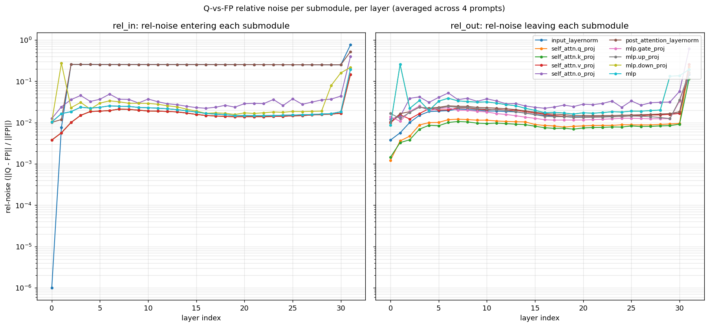
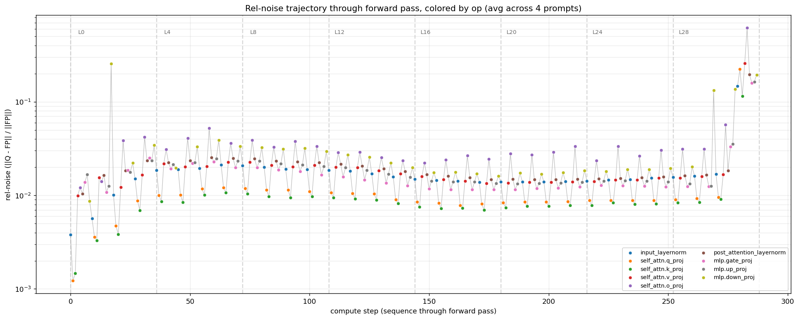
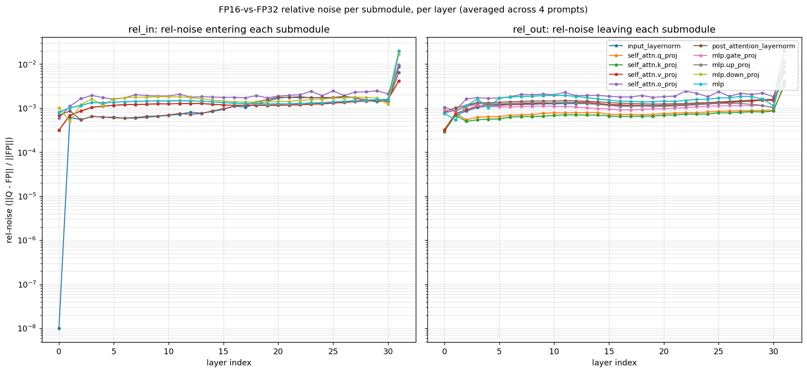
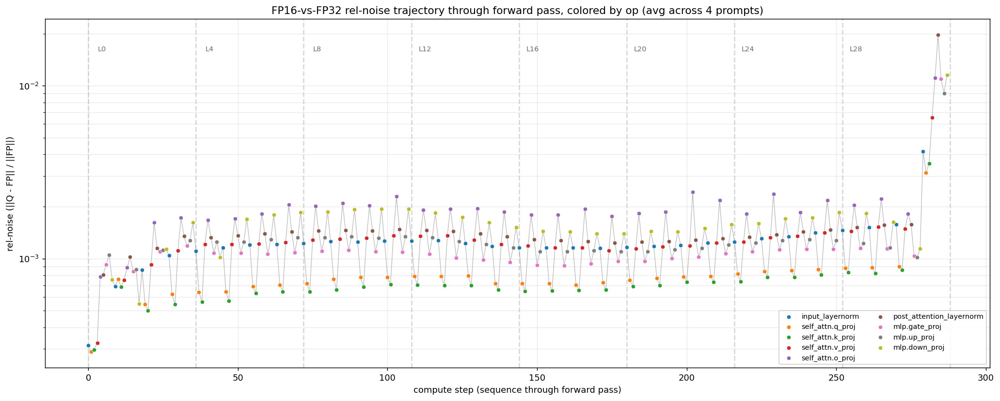
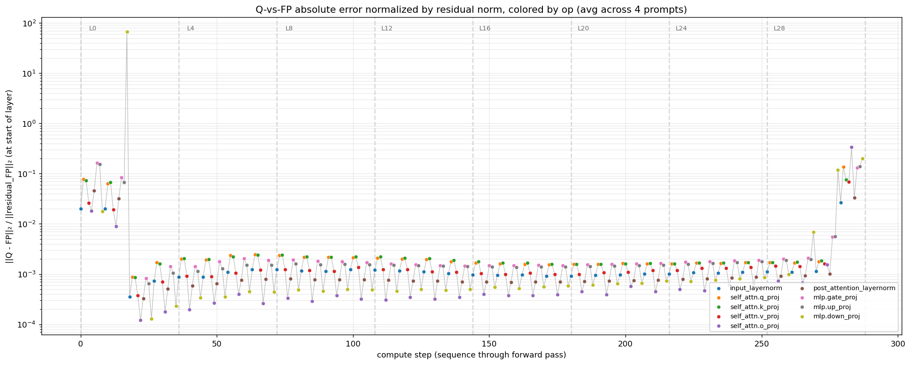
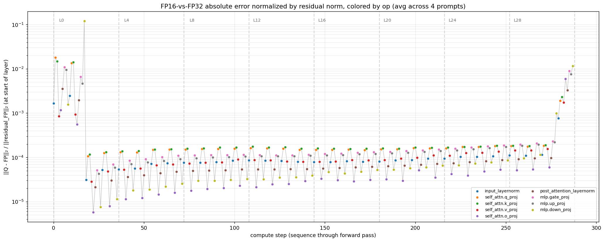
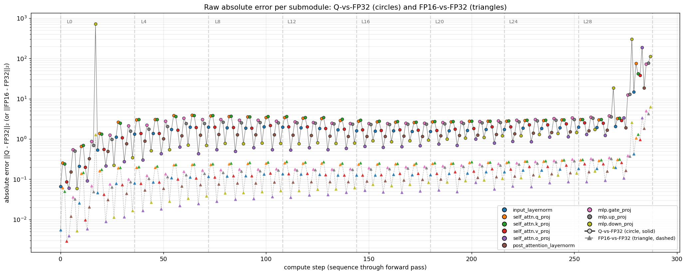
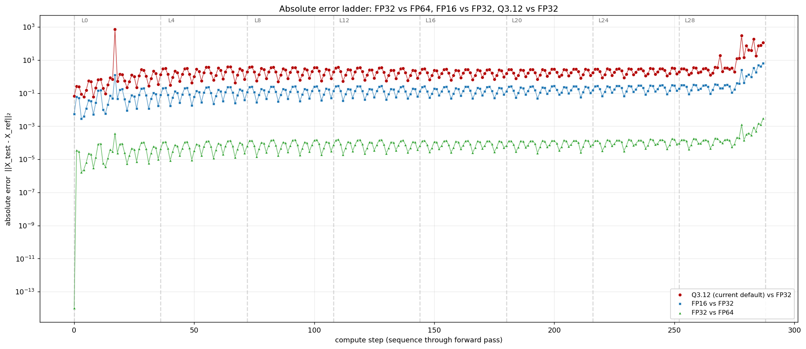

# Quantization Accuracy Evaluation for Ligero LLM Inference Proofs

## 1 Overview

The Ligero protocol design in `design-feasibility.md` assumes a fixed-point integer-arithmetic execution of LLM inference (Q3.12 by default: stored values are integers at scale `2^12`, real values in roughly `[-8, 8]`). The prover commits to those integer values, the verifier checks them with field-arithmetic constraints, and lookup tables handle the nonlinearities. This document records the empirical accuracy of that execution on Llama-2-7B against an FP32 reference, the methodology bugs we found and fixed along the way, and the headline measurements that should drive future parameter choices.

The simulation lives in `ligero/analysis/quantization_accuracy_sim.py`. It replaces every operation in Llama-2-7B with a Q-grid equivalent, runs FP and Q forward passes side by side, and compares submodule outputs and final logits. It does not produce a proof. It measures whether the protocol's arithmetic, if executed faithfully, gives outputs close enough to the FP reference to be useful.

### 1.1 What the simulation models

Q-grid replacements wired in by `patch_model_inplace` and `install_activation_patches`:

- `nn.Linear` (all projections: q/k/v/o, gate/up/down, lm_head) becomes `QuantizedLinear`. Weights are rounded to int64 at the chosen scale. The matmul runs in FP64 (PyTorch has no int64 GEMM on CUDA), which is bit-exact at our magnitudes because the accumulator stays well below `2^53`.
- `LlamaRMSNorm` becomes `QuantizedRMSNorm`. The rsqrt step uses a log-spaced lookup table over `[eps, 512]` because `mean(X²)` spans roughly seven orders of magnitude in Llama-2.
- `F.silu` becomes `QuantizedSiLU` via a linear-spaced lookup table over `[-x_max, x_max]`. Inputs outside that range are clamped.
- `F.softmax` becomes `QuantizedSoftmax`. Row-max shift and exp-range clip happen in FP, then quantize, then table-based exp and `1/sum`.
- `QK^T` and `attn_weights @ V` (`torch.matmul` calls inside `LlamaAttention.forward`) are replaced by `quantized_matmul`.
- The `silu(gate) * up` elementwise multiply in `LlamaMLP.forward` is replaced by `quantized_hadamard`.

The model must be loaded with `attn_implementation="eager"`. The default in recent transformers is `sdpa`, which uses a fused kernel that never calls `F.softmax`. The monkey-patched `QuantizedSoftmax` would silently never fire under SDPA. The diagnostics all force eager mode.

### 1.2 What the simulation does not model

- **Per-channel weight scales.** Every matrix uses one global scale. The standard LLM-quantization fix for outlier channels is per-row or per-channel scales; we have not implemented this.
- **Native NVFP4 / block-scaled FP4 emulation.** Real Blackwell-class inference uses block-scaled FP4 with FP8 E4M3 per-block scales. The ZK gadget design for emulating that format bit-exactly is in [`docs/nvfp4-exact-path.md`](docs/nvfp4-exact-path.md) (which replaced a never-committed `quantization-emulation.md`). This simulation evaluates a global-scale Q3.12 path, not the NVFP4 path.
- **Proof-system overheads.** The simulation only measures arithmetic accuracy. It does not commit, encode, or verify anything.
- **Hardware floating-point noise on FP reference.** The FP reference is FP32 PyTorch. We treat it as the ground truth.
- **RoPE quantization.** RoPE is applied in FP throughout. It is deterministic and applies a unit-norm rotation, so its contribution to overall drift is small, but we have not measured this precisely.

## 2 Diagnostics

The simulation exposes a CLI with several diagnostics, each measuring a different aspect of Q-vs-FP behavior.

| Flag | Purpose | Runtime (Spark, Llama-2-7B) |
|---|---|---|
| `--smoke` | Single forward pass for sanity. | ~30 s |
| `--rel-noise` | Per-submodule rel-noise growth (rel_in, rel_out, rel_amp) across all decoder layers. | ~90 s |
| `--ablate-submodule` | For each named submodule, splice FP output into the Q forward and measure the drop in final-logits drift. Distinguishes injection from transmission. | ~3 min |
| `--attn-breakdown` | Fine-grained rel-noise inside the attention block (softmax in/out via F.softmax wrapper). | ~3 min |
| `--scale-sweep` | Sweep any combination of scale, T, `silu_x_max`, `exp_clip`. Reports rel-drift, top-1 match, and bits/token per config. | ~30 s per config |
| `--unexplained` | Compute the Gibbs unexplained-information bound (covert-channel capacity) with optional WikiText sample and σ calibration. | ~3 min |
| `--per-op` | Per-op local precision check (matmul output bit-exactness, etc.). | ~10 s |
| `--layer-drift` | Final-logits drift trajectory as we progressively quantize one extra layer at a time. | ~5 min |
| `--submodule-drift` | Same as `--rel-noise` but using absolute (not relative) norm ratios. Kept for historical comparison; superseded by `--rel-noise`. | ~90 s |

All flags accept `MODEL_PATH` as an environment variable pointing at a local Llama-2-7B checkpoint (the HF cache path or a fully unpacked directory). Without it, the script falls back to fetching `meta-llama/Llama-2-7b-hf` from the Hub, which can stall on parallel-download lock contention.

Example commands appear in §7.

## 3 Methodology bugs we found and fixed

Three issues silently invalidated earlier measurements. All three are now fixed and committed.

### 3.1 SDPA bypass of F.softmax

`install_activation_patches` monkey-patches `torch.nn.functional.softmax`, but the HuggingFace Llama default is `attn_implementation="sdpa"`, which calls `torch.nn.functional.scaled_dot_product_attention`, a fused kernel that never reaches `F.softmax`. Earlier simulations reported Q3.12 accuracy under the assumption that softmax was quantized; in fact it was running at the model's float dtype throughout. The fix is to force `attn_implementation="eager"` on `from_pretrained`. All diagnostics now do so. As a side benefit, `F.softmax` capture-via-wrapping inside `--attn-breakdown` actually fires.

### 3.2 QuantizedSoftmax mask overflow

The original `QuantizedSoftmax.__call__` ran the row-max shift in int64:

```python
s_int = quantize_to_int(scores, scale)
shifted = s_int - s_int.max(dim=dim, keepdim=True).values
clipped = shifted.clamp(min=-clip_int, max=0)
```

Llama causal-mask values are `-inf` (or `torch.finfo(dtype).min`), which cast to int64 garbage near `INT64_MIN`. The subsequent subtraction wrapped negative-overflow into positive-overflow, then `.clamp(min=-clip_int, max=0)` lifted those positive-overflow values back to 0. Net effect: masked positions ended up with shifted score 0 (which represents "same as max") and got post-exp value 1 instead of 0. Causal-masked positions ended up with softmax weight roughly `1/N` instead of 0.

Direct test on causal scores: FP softmax norm 2.62, Q softmax norm 1.81, rel diff 80%. After fix: rel diff 0.04%.

The fix moves the row-max shift and exp-range clip into FP, before quantization:

```python
max_scores = scores.max(dim=dim, keepdim=True).values
shifted_fp = (scores - max_scores).clamp(min=-self.exp_clip, max=0.0)
clipped = quantize_to_int(shifted_fp, self.scale)
```

The protocol's softmax already handles masked positions separately via a public attention mask (the verifier knows which positions are masked), so this rearrangement is simulation-only and does not change protocol semantics.

### 3.3 Inner-attention matmuls and MLP hadamard not quantized

`patch_model_inplace` only replaces `nn.Linear` and `LlamaRMSNorm` modules. The two `torch.matmul` calls inside attention (`QK^T` and `attn_weights @ V`) and the elementwise `silu(gate) * up` in `LlamaMLP.forward` are not `nn.Module` instances and were therefore never quantized. The fix introduces `quantized_matmul` and `quantized_hadamard` helpers and a `patch_inner_ops_inplace` pass that replaces the forward methods on `LlamaAttention` and `LlamaMLP` instances with versions that route these ops through the Q grid.

Bisect after the fix (single layer, isolation, FP-clean input):

| config | attn.out rel | mlp.out rel |
|---|---|---|
| Linear + RMSNorm patched only | 1.19% | 0.83% |
| + Q inner matmul + hadamard | 1.19% | 0.84% |
| + Q softmax + silu (full Q) | 1.19% | 0.83% |

Adding Q at the inner-matmul and hadamard sites is essentially free. The previous "partial Q" simulation gave correct numbers for what it actually measured, but those numbers reflected a different protocol than the design doc describes.

## 4 Where the error comes from

### 4.1 Per-block injection in isolation

The bisect in §3.3 establishes a baseline: a single quantized transformer block fed FP-clean inputs produces 1.2% rel-drift at the attention output and 0.8% rel-drift at the MLP output. This is the "intrinsic" quantization injection per block, before any compounding.

### 4.2 Residual-stream accumulation

Across the full 32-layer forward pass, rel-drift at the residual stream saturates around 7-13% (depending on which submodule we measure at). Each block adds roughly 1% of its own output, and the residual norm grows with depth, so the steady-state ratio of injected-noise to residual-norm balances around 10%. The layer-by-layer trace from `--rel-noise` confirms this: rel-drift at mlp.in jumps from 1% at layer 0 to ~8% by layer 3, then stays flat through layer ~25 with spikes at specific layers (1, 16, 19, 30).

The full picture per submodule per layer, log scale, is in `figures/rel_noise_per_layer.png`:



The trajectory view (each compute step in sequence through the forward pass, line linking consecutive ops, points colored by op type) is in `figures/rel_noise_trajectory.png`:



The trajectory view makes two things obvious that the per-submodule view does not: (i) the sawtooth pattern within each layer, where rel-noise drops at the layernorms and rises at the projections plus the silu × up multiply, and (ii) the layer-0 dramatic dip to ~10⁻⁵ at `input_layernorm` because the residual is still essentially the FP embedding. The spike at layers 29-31 visible on the right end is the same pattern the per-submodule plot showed.

Raw CSV: `figures/rel_noise_per_layer.csv` (columns: layer, submodule, rel_in, rel_out). Regenerate via `python analysis/quantization_accuracy_sim.py --rel-noise`; the script writes the CSV and both PNGs to `$REL_NOISE_CSV`, `$REL_NOISE_PNG`, and `$REL_NOISE_TRAJECTORY_PNG` (defaults `/tmp/rel_noise.{csv,png}` and `/tmp/rel_noise_trajectory.png`).

### 4.2.1 FP16 baseline

The same diagnostic run with `--rel-noise-fp16` swaps Q for a freshly-loaded FP16 model. No Q-grid mechanisms involved. This gives the "natural" noise growth of running Llama-2-7B in lower precision, against which the Q numbers can be calibrated.





The structural pattern is identical to the Q-vs-FP32 plots: same within-layer sawtooth, same layer-0 cold-start dip, same layer 29-31 cluster spike. So those features are inherent to Llama-2-7B's noise propagation, not artifacts of the Q-grid. Only the *magnitude* differs:

| metric | FP16 vs FP32 | Q3.12 (orig default) vs FP32 | Q4.14 + x_max=20 vs FP32 |
|---|---|---|---|
| body-of-network rel-noise | ~10⁻³ | ~10⁻¹ | ~3 × 10⁻² |
| layer-31 spike | ~2 × 10⁻² | ~2 × 10⁻¹ | ~2 × 10⁻¹ |
| approximate ratio to FP16 floor | 1× | ~50× | ~25× |

The current Q optimum sits about 25× above the FP16 floor. That ratio is the Q-grid's "precision tax" relative to what a verifier comparing against FP16 inference would already accept as the propagation envelope. Closing it is what per-channel scales or FP8 would attack; the structural mechanisms in §4.3 below operate the same way at any precision.

### 4.2.2 Globally-normalized view (error / residual norm)

The plots in §4.2 normalize each submodule's error by *that submodule's own FP output norm*. That mixes two effects: actual error magnitude and the local output magnitude. To separate them, the diagnostic also produces a third plot using a single consistent denominator per layer (`||residual_FP||₂` at the layer's input, captured automatically):





Two things become much cleaner in this view:

1. The within-layer sawtooth in the §4.2 plots was largely an artifact of submodule output norms varying across the layer. When the denominator is held constant within a layer, within-layer variation almost vanishes.

2. The body-of-network trend is a gentle *downward* drift, because the residual norm grows with depth while per-layer absolute error stays bounded. Layer 0 has the largest per-residual error of the body because `||residual||_0 ≈ ||embedding||` is small. Layer 31 spikes back up because absolute error there grows faster than the residual norm.

The Q-vs-FP16 magnitude gap in the per-residual view is ~100× in the body (vs ~50× in the rel-noise view); the larger gap reflects that the rel-noise view "averages out" some of the difference because both Q and FP16 inherit similar local-output-norm variations.

CSVs at `figures/rel_noise_per_layer.csv` and `figures/rel_noise_per_layer_fp16.csv` now include `err_in_per_resid` and `err_out_per_resid` columns alongside `rel_in` and `rel_out`.

### 4.2.3 Raw absolute error comparison

Combined plot of raw `||Q - FP32||₂` and `||FP16 - FP32||₂` at each submodule, on the same axes. Q-vs-FP32 are solid-line circles, FP16-vs-FP32 are dashed-line triangles, both colored by op type.



Generated by `analysis/plot_abs_error_compare.py` (reads the two CSVs and overlays them). The key thing this plot shows that none of the others did: **the Q/FP16 ratio is not constant**. Sample values for `mlp.down_proj` across the network:

| layer | Q abs err | FP16 abs err | ratio Q/FP16 |
|---|---|---|---|
| 0 | 6.0e-2 | 5.2e-3 | 12× |
| **1** | **7.2e+2** | 1.3 | **560×** |
| 5 | 0.55 | 0.028 | 19× |
| 15 | 0.80 | 0.062 | 13× |
| **30** | **3.0e+2** | 2.6 | **117×** |
| 31 | 1.1e+2 | 6.3 | 18× |

In the body of the network Q's absolute error is only ~13-19× larger than FP16's. At the spike layers (1, 30) the ratio explodes to 100-500×. Both Q and FP16 see those layers as spikes (they're intrinsic to the model), but Q's spikes are dramatically taller relative to its own body than FP16's are. That isolates a clean diagnosis: **Q is *specifically* worse at outlier-feature layers**, not uniformly worse everywhere. Per-channel scales (or similar outlier-targeted fixes) would attack precisely the right thing.

CSVs now also include `abs_err_in` and `abs_err_out` columns; the comparison plot script lives at `analysis/plot_abs_error_compare.py`.

### 4.2.4 Precision ladder: FP32 vs FP64 baseline

`--rel-noise-fp32` runs the diagnostic with FP64 as the reference and FP32 as the test. This isolates the *intrinsic FP32 rounding error* of Llama-2-7B's forward pass, independent of any quantization scheme. A 3-way overlay (FP32 vs FP64, FP16 vs FP32, Q3.12 vs FP32) is at `figures/abs_error_ladder.png`:



Generated by `analysis/plot_abs_error_ladder.py`. Two things this view establishes:

1. **All three plateau in the body of the network.** Absolute-error saturation is a structural property of Llama-2-7B's residual-stream propagation, not a Q-specific phenomenon. The plateaus sit roughly 1000× apart, matching the relative fractional-bit budgets of the three precisions.
2. **Shape is shared but Q-grid exaggerates the spike layers.** Layer 1 is uniquely catastrophic for Q (~10³ above its body floor) while FP16's layer-1 spike is only ~3× above its body and FP32-vs-FP64's layer-1 is essentially flat. Layer 31's spike is present at all three precisions but Q's relative spike size (~30× body) is twice FP16's (~10× body).

Approximate body-floor magnitudes for `mlp.down_proj.out`:

| comparison | body floor | layer 1 | layer 31 |
|---|---|---|---|
| FP32 vs FP64 | ~10⁻⁴ | ~10⁻³ | ~10⁻³ |
| FP16 vs FP32 | ~10⁻¹ | ~10⁰ | ~10¹ |
| Q3.12 vs FP32 | ~10⁰ | **~10³** | ~10² |

The FP32-vs-FP64 trajectory is the floor: any future quantization scheme that uses an FP32 reference cannot have absolute error smaller than this. Closing the gap from Q's ~10⁰ body floor to FP16's ~10⁻¹ body floor is the legitimate target for protocol-level improvements (per-channel scales, FP8 reference, multi-segment tables).

### 4.3 Bilinear amplification at silu*up and QK^T

Two ops *transmit* upstream noise but don't reduce it; they multiply two already-noisy tensors:

- In MLP: `silu(gate_proj(x)) * up_proj(x)`. Both factors carry ~6% rel-noise. The product carries roughly `rel(gate) + rel(up) ≈ 12%`. This is visible directly in the rel-noise table: gate_proj.out and up_proj.out each have rel ~6%, but down_proj.in (which equals their product) has rel ~12%.
- In attention: `softmax(QK^T / sqrt(d)) @ V`. Same pattern. q_proj.out and k_proj.out each have rel ~5%, but o_proj.in (which equals the attention output) has rel ~12%.

These are not new error sources from quantization. They are unavoidable propagation through bilinear math. Tightening per-op quantization does not reduce them; reducing the rel-noise *entering* them does.

### 4.4 Ablation: which submodule is the gateway

`--ablate-submodule` splices the FP output of a chosen submodule into the Q forward pass at every layer and measures the drop in final-logits drift:

| ablated submodule | rel. logits drift | reduction vs baseline |
|---|---|---|
| (none, baseline) | 12.88% | 0% |
| input_layernorm | 9.94% | 22.9% |
| self_attn.q_proj | 14.63% | **-13.6%** (worse) |
| self_attn.k_proj | 10.43% | 19.0% |
| self_attn.o_proj | 9.93% | 22.9% |
| self_attn (whole) | 9.93% | 22.9% |
| post_attention_layernorm | 5.57% | 56.7% |
| mlp.gate_proj | 13.94% | **-8.2%** (worse) |
| mlp.up_proj | 12.48% | 3.1% |
| mlp.down_proj | 4.29% | **66.7%** |
| mlp (whole) | 4.29% | **66.7%** |

Three observations:

1. `mlp == mlp.down_proj` (both 66.7%). The MLP block has exactly one gateway through which its accumulated error reaches the residual stream: down_proj. Cleaning anything earlier than down_proj inside the MLP doesn't help once down_proj transmits.
2. `q_proj` and `gate_proj` ablations make drift *worse*. Counterintuitive but correct: noise in q_proj is partially cancelled downstream by noise in k_proj when QK^T computes their dot product. Replacing q_proj with FP disrupts the cancellation. Per-projection error reduction in isolation can backfire if the downstream consumers were co-tuned.
3. `post_attention_layernorm` already captures 56.7%, but `mlp.down_proj` reaches 66.7%. The extra 10pp comes from MLP-internal injection (the silu+multiply gap from §4.3) on top of upstream noise.

## 5 Sweeps

All sweeps below use 8 WikiText-2 chunks (~64 tokens each, ~1300 positions total) at default `T=2^16` unless noted.

### 5.1 Scale at fixed silu_x_max=32

| scale | step | rel-drift | top-1 match | bits/tok |
|---|---|---|---|---|
| 2^10 | 9.8e-4 | 11.4% | 92.99% | 1.584 |
| 2^12 (Q3.12) | 2.4e-4 | 6.5% | 96.70% | 1.555 |
| 2^14 | 6.1e-5 | 6.0% | 96.70% | 1.556 |
| 2^16 | 1.5e-5 | 5.9% | 96.98% | 1.557 |
| 2^18 | 3.8e-6 | 5.9% | 96.98% | 1.556 |
| 2^20 | 9.5e-7 | 5.9% | 96.98% | 1.556 |

Scale matters from Q2.10 to Q3.12, then plateaus. Going from Q3.12 (current default) to Q4.20 (the maximum compatible with Goldilocks for Llama-2-7B's largest contraction) reduces rel-drift by only 0.6 percentage points.

### 5.2 Table size T at scale 2^14, silu_x_max=32

| T | rel-drift | top-1 match |
|---|---|---|
| 2^14 | 6.10% | 96.84% |
| 2^16 | 6.03% | 96.70% |
| 2^18 | 6.04% | 96.84% |

T has no measurable effect at this scale. Tables are over-sampled at the natural resolution of their input ranges.

### 5.3 silu x_max at scale 2^14, T=2^16

| x_max | rel-drift | top-1 match | bits/tok |
|---|---|---|---|
| 4 | 30.1% | 81.87% | 1.553 |
| 8 | 12.6% | 90.93% | 1.573 |
| 12 | 7.5% | 96.43% | 1.524 |
| 16 | 5.32% | 97.80% | 1.506 |
| **20** | **3.93%** | **99.45%** | 1.514 |
| 24 | 3.80% | 99.31% | 1.519 |
| 32 (old default) | 6.03% | 96.70% | 1.556 |
| 64 | 10.67% | 94.37% | 1.734 |
| 128 | 10.68% | 94.37% | 1.734 |
| 256 | 10.75% | 94.23% | 1.733 |

This is the headline finding of the evaluation. The silu lookup table's bin width is `2·x_max / T`, fixed in real units, regardless of the matmul scale. At `x_max=32`, each bin spans `9.8 × 10^{-4}` real units, which is coarser than the actual density of silu inputs in Llama-2-7B. At `x_max=20` the bin width is `6.1 × 10^{-4}`, which matches the real input density much better. Below `x_max=16` the clamp starts eating real values (Llama-2 gate_proj outputs do reach 15-18 in non-outlier positions), and above `x_max=24` the bin width is too coarse to resolve typical silu inputs near zero.

For comparison, the original default of `x_max=32` was inherited from an earlier configuration in which silu was being saturated at 8 and we doubled it twice as a fix. The empirical optimum is approximately 20.

### 5.4 exp_clip at scale 2^14, T=2^16, silu_x_max varied

| silu_x_max | exp_clip | rel-drift | top-1 |
|---|---|---|---|
| 16 | 16 | 5.32% | 97.80% |
| 16 | 32 | 5.32% | 97.80% |
| 32 | 16 | 6.03% | 96.70% |
| 32 | 32 | 6.03% | 96.84% |

Softmax `exp_clip` does not bind at either silu_x_max. Llama-2-7B attention scores after the `1/sqrt(d_head)` scaling and row-max shift stay within `[-16, 0]` in our test sample.

### 5.5 Combined optimum

At silu_x_max=20, the residual headroom from bumping scale or T is small:

| scale | T | rel-drift | top-1 match |
|---|---|---|---|
| 2^12 (Q3.12) | 2^16 | 4.25% | 99.04% |
| 2^14 | 2^16 | 3.93% | 99.45% |
| 2^14 | 2^18 | 3.93% | 99.45% |
| 2^16 | 2^16 | 3.93% | 99.59% |
| 2^20 | 2^16 | 3.92% | 99.59% |

The recommended configuration is scale=2^14, T=2^16, silu_x_max=20, exp_clip=16. Scale=2^14 sits at the knee of the scale curve, top-1 match is 99.45%, and the protocol cost is identical to Q3.12 (same per-value field-element count).

## 6 Unexplained information bound

The Gibbs covert-capacity bound is computed by `--unexplained --wikitext --calibrate` over 16 WikiText chunks (~2655 positions). The bound treats FP logits as a noisy estimate of a "true" model with Gaussian noise `σ` on each logit, and reports `-E[log_2 Q(FP_top1)]` minimized over `σ`.

### 6.1 Headline comparison

| | Pre-fix (Q3.12, x_max=32, SDPA bypass + softmax bug) | Post-fix optimum (Q4.14, x_max=20, eager, full Q) |
|---|---|---|
| Calibrated σ | 1.55 | 0.076 |
| Top-1 agreement | 97.2% | 98.9% |
| FP baseline rate | (not separately reported) | 0.053 bits/tok |
| Q rate | (not separately reported) | 0.383 bits/tok |
| **Quantization extra** | **+0.65 bits/tok** | **+0.33 bits/tok** |

The calibrated σ drop from 1.55 to 0.076 is informative. σ is how much noise the optimizer attributes to FP to "explain" the gap between Q and FP. The old configuration produced wildly different logits, forcing a large σ; the new configuration matches FP closely enough that a tight σ suffices. A smaller σ corresponds to a stricter verifier and a tighter capacity bound for any given Q-FP gap.

### 6.2 Per-prompt distribution

The +0.33 bits/tok aggregate hides a bimodal distribution. Per-prompt deltas (Q rate minus FP baseline rate, sorted):

| range | count out of 16 | example prompt's delta |
|---|---|---|
| < 0.02 bits/tok | 11 | 0.0002, 0.0013, 0.0018, 0.0045, ... |
| 0.3 to 0.8 bits/tok | 5 | 0.330, 0.536, 0.616, 0.703, 0.753 |

Eleven prompts have essentially perfect Q-to-FP agreement. Five prompts exhaust almost the entire aggregate. The five outlier prompts are presumably the ones where outlier activation channels matter for the next-token prediction, since outlier behavior is the documented failure mode of single-scale fixed-point LLM quantization. We have not yet characterized exactly what these five prompts have in common.

## 7 Recommended configuration and remaining headroom

### 7.1 Configuration

```
scale = 2^14
T = 2^16
silu_x_max = 20.0
exp_clip = 16.0
attn_implementation = "eager"
ref_dtype = "fp32"
```

These are the defaults in `analysis/quantization_accuracy_sim.py` as of commit `08597ed`. The `silu_x_max=20` change (was 32) is the largest single improvement and is purely a hyperparameter choice with zero protocol cost.

### 7.2 Reproduction

The headline tables in this document were produced by:

```bash
# Tables 5.1 (scale sweep at default silu_x_max)
MODEL_PATH=/path/to/llama-2-7b-hf python analysis/quantization_accuracy_sim.py --scale-sweep \
  --sweep-scales 1024,4096,16384,65536,262144,1048576 --sweep-silu-xmax 32

# Tables 5.2 (T sweep)
... --scale-sweep --sweep-scales 16384 --sweep-Ts 16384,65536,262144 --sweep-silu-xmax 32

# Table 5.3 (silu_x_max sweep)
... --scale-sweep --sweep-scales 16384 --sweep-silu-xmax 4,8,12,16,20,24,32,64,128,256

# Table 6.1 (unexplained info at new optimum)
... --unexplained --wikitext --calibrate --scale 16384 --T 65536

# Table 4.4 (ablation)
... --ablate-submodule

# Rel-noise table per §4 (referenced but not fully tabulated here)
... --rel-noise
```

All commands assume Llama-2-7B weights are at `$MODEL_PATH`. On the Spark (GB10, 121 GiB unified memory), a single sweep config takes ~30 seconds including model load. Full sweeps take 3-6 minutes.

### 7.3 Remaining headroom

The optimum reaches +0.33 bits/tok of quantization-specific extra, of which essentially all comes from 5 out of 16 prompts (§6.2). Four directions to attack this:

**Per-channel weight scales.** Replace each matrix's single global scale with one scale per output channel (`scale_o` for row `o` of `W`). The protocol cost is one extra commit of size `d_out` per matrix, negligible compared to `R_W`. This is the standard production-LLM quantization fix for outlier channels. Plausibly cuts the 5-prompt failure mode by 2-5x. Not yet implemented.

**FP8 reference Q, or native NVFP4 emulation.** Reframe Q as "what FP8/FP4 inference would compute" rather than "what FP32 would compute." Real Blackwell-class deployment hardware computes natively in block-scaled FP4, so matching that arithmetic is the natural protocol target for production verifiers. The ZK gadget that emulates NVFP4 bit-exactly is in [`../quantization-emulation.md`](../quantization-emulation.md); per its analysis, the quant step adds less than 1× of raw-inference time at the H100/N=10⁹ regime. Per-row weight and per-token activation scales (essentially required for FP8 LLM quality) ride along.

**Finetune an int32 model to match an FP4 model's per-layer activations.** A complementary alternative to the bit-exact emulation above: rather than reproducing FP4 rounding semantics inside the proof, *train* a high-precision integer-grid model whose per-layer activations match an FP4 reference model's. The student is an int32 (or int24) representation, trained with a per-layer activation-matching loss against a teacher running in NVFP4. The proof then verifies the student. Practical implications:

- The verifier's semantics shift from "this is what FP32 would have computed" to "this is what a model trained to mimic FP4 produces." The exact FP4 rounding never has to be reproduced in-circuit.
- Cost moves from runtime (in-protocol FP4 emulation per matmul) to one-time training (activation-matching distillation, run once per model release).
- Plays well with the precision-scaling literature (§8.2): training in low precision teaches weights to be quantization-robust, so the int32 student should naturally end up in a noise-tolerant region of weight space.
- Open question: how tight an activation match is achievable before the student deviates from FP4 in ways that affect outputs. The per-layer mlp.down_proj activations are typically the bottleneck; that's where the largest absolute errors live (§4.4).

**Activation matching is one option, distinct from output matching.** Standard knowledge distillation (Hinton et al., 2015 and most LLM distillation in production: DistilBERT, MiniLM, etc.) trains the student to match teacher *output logits*, not per-layer activations. A separate line of work — FitNets, TinyBERT, MobileBERT — adds per-layer hidden state and attention-map matching. Both are options for the int32-vs-FP4 use case, with different properties:

- Output-only matching gives the student freedom to find any set of weights that produces FP4-equivalent outputs. Simpler loss, less constrained.
- Per-layer activation matching pins the student's intermediate states to the teacher's. Denser supervision signal but more restrictive.

The choice has implications for what the resulting proof certifies — "produces outputs equivalent to FP4" under output-only matching vs "produces internal trajectories equivalent to FP4" under activation matching — and which is wanted depends on the verification semantics one is targeting. Worth a small-scale prototype either way: take a 1B-parameter Llama variant, run FP4 inference with cached activations and outputs, finetune the int32 copy for ~100M tokens with the chosen loss, then evaluate top-1 agreement against the FP4 model.

**Multi-segment silu.** Replace the single linear-spaced table with a hybrid: fine bins where the silu function has high derivative (near 0), coarse bins where it's near-linear (tails). Trades some lookup-argument complexity for better resolution where it matters. Modest expected gain; would attack the silu floor rather than the outlier-channel floor.

### 7.4 What we have not measured

- The full sweep at scales 2^14 to 2^20 with silu_x_max=20 used WikiText-2 chunks but only 8 chunks × 64 tokens. The `--unexplained` measurement used 16 chunks × ~165 tokens. We have not measured on a held-out set; σ calibration is in-sample.
- Decode-mode evaluation (autoregressive token generation) was not run. All measurements use teacher-forced prefill, which scores Q at every token position assuming the previous tokens are correct. Decode would compound any quantization error through autoregression.
- Outlier-channel statistics for Llama-2-7B were not measured directly. We infer outlier behavior from the bimodal per-prompt distribution but have not located the specific channels that drive the 5-prompt failure mode.
- Performance on longer contexts (S > 200) was not tested. At very long context, the softmax `S²` cost and accumulated rel-noise through the attention block could both grow.

## 8 Related literature on noise propagation and scaling

The plateau-in-the-body behavior visible in §4.2 (and across all three precision comparisons in the §4.2.4 ladder) is not specific to our setup. It's a documented property of trained deep transformers and has been studied from several angles in recent literature. This section sketches the relevant works and how their findings relate to our measurements.

### 8.1 Why absolute error saturates with depth

**Noise Stability of Transformer Models** (Mehta et al., arxiv:2602.08287) formalizes noise stability as a model's robustness to correlated perturbations applied to all input coordinates, derives multi-layer noise propagation via a covariance interval propagation argument, and shows that variance accumulation through transformer layers stays bounded (rather than growing exponentially) when LayerNorm and residual connections are present. Their theoretical model predicts the kind of saturation we observe: per-layer added noise balances against attenuation through the layer's contractive components, giving a steady state.

**Characterizing stable regions in the residual stream of LLMs** (Heimersheim et al., arxiv:2409.17113) studies this empirically. They identify "stable regions" in the residual stream of trained transformers where small activation perturbations cause minimal output change, with sharp boundaries between regions. The paper explicitly hypothesizes "error correction from superposition interference" as one mechanism. Boundary sharpness scales with both parameter count and training tokens (Figure 3c in the paper). Our bimodal failure mode in §6.2 (11 out of 16 prompts negligible quantization extra, 5 catastrophic) maps cleanly onto this picture: the bad prompts likely sit near stable-region boundaries, where Q3.12 perturbation pushes them across.

**Lipschitz analysis** (e.g., Pauli et al., arxiv:2404.04375) shows that worst-case Lipschitz constants of trained transformers grow exponentially with depth in theory but the effective Lipschitz along the data manifold is far smaller. The saturation we see is the empirical version of this: trained Llama-2-7B has effective layer-wise contraction roughly equal to 1, allowing per-layer noise contributions to balance rather than compound.

### 8.2 Quantization tolerance scales with model size and training

**Scaling Laws for Precision** (Kumar et al., ICLR 2025, arxiv:2411.04330) derives a precision-aware scaling law:

```
δ_PTQ(N, D, P_post) = C_T · (D^γ_D / N^γ_N) · exp(-P_post / γ_post)
```

where `N` is parameter count, `D` is training tokens, and `P_post` is post-train quantization precision. Three findings relevant to our work:

1. **Larger models tolerate quantization better.** The `N^(-γ_N)` term means that for fixed dataset size, larger models incur smaller degradation from quantization.
2. **More training data hurts quantization tolerance.** The `D^γ_D` term means overtrained models become more fragile to quantization, not less. Models pretrained at high D/N ratios can have *increasing* post-quantization loss with additional pretraining.
3. **Training in low precision teaches noise robustness.** Models trained at low precision learn weights that are robust to quantization noise. The "error correction in weights" framing is empirically validated.

Llama-2-7B sits at high D/N (2T tokens for 7B parameters), which by this law is the regime predicted to have heightened quantization sensitivity. Our `+0.33 bits/tok` overhead after tuning is consistent.

**Smaller = Weaker?** (Yuan et al., arxiv:2506.22776) sees the size effect at 70B scale ("delayed collapse"). **Reliability Scaling Laws for Quantized LLMs** finds non-monotonic reliability with bit precision, with a 4-bit sweet spot for moderate-sized models.

### 8.3 Implications for our work

The literature lines up with what we see and refines what the next interventions should target:

- Saturation of absolute error with depth (our §4.2.4 ladder) reflects a real structural property, not a measurement artifact. The shape is precision-independent; only magnitude changes.
- The Q-specific catastrophe at layer 1 (§4.3 of this doc) is consistent with stable-region-boundary crossings caused by Q3.12's outlier handling at a "first feature detection" layer. The fix is the same one Kumar et al. point to: tighter local precision via per-channel scales, or quantization-aware training of the model itself.
- Llama-2-7B is on the wrong side of the D/N ratio for easy quantization. Newer models trained closer to the compute-optimal D/N (e.g., Llama-3-8B at ~15T tokens but with better-tuned training) may be more robust; very large overtrained models (Llama-3-70B at the same D/N as 7B) may be worse.

These connections justify the headroom directions in §7.3 (per-channel scales, NVFP4 emulation, int32-finetune-to-match-FP4, multi-segment tables) and align with the "Scaling Laws for Precision" prescription: train in low precision rather than retrofitting it. For exact NVFP4 emulation inside the proof, the ZK gadget is documented in [`../quantization-emulation.md`](../quantization-emulation.md). For the alternative path of distilling FP4 behavior into a high-precision integer student that the proof verifies, see the third direction in §7.3.

### 8.4 Key references

- [Scaling Laws for Precision (Kumar et al., ICLR 2025)](https://arxiv.org/abs/2411.04330)
- [Characterizing stable regions in the residual stream of LLMs (Heimersheim et al., 2024)](https://arxiv.org/abs/2409.17113)
- [Noise Stability of Transformer Models (Mehta et al., 2026)](https://arxiv.org/abs/2602.08287)
- [Oscillations Make Neural Networks Robust to Quantization (Nagel et al., 2025)](https://arxiv.org/html/2502.00490v1)
- [Compositional Estimation of Lipschitz Constants for Deep Neural Networks (Pauli et al., 2024)](https://arxiv.org/html/2404.04375v1)
- [Smaller = Weaker? Benchmarking Robustness of Quantized LLMs (Yuan et al., 2025)](https://arxiv.org/html/2506.22776)
- [Noisy Machines: Understanding Noisy Neural Networks (Zhou et al., 2020)](https://arxiv.org/abs/2001.04974)
- [Defensive Quantization (Lin et al., ICLR 2019)](https://openreview.net/forum?id=ryetZ20ctX)
- [Robust Quantization: One Model to Rule Them All (Shkolnik et al., 2020)](https://ar5iv.labs.arxiv.org/html/2002.07686)
- [Scaling Trends in Language Model Robustness (Howe et al., 2024)](https://arxiv.org/abs/2407.18213)


## 9 Pointers

- Code: `ligero/quantization_accuracy_sim.py`. The CLI flags are listed by `--help`.
- Protocol description: `ligero/design-feasibility.md` §3 (constraint families) and §4.6 (LogUp instances per Maverick prefill).
- Analytical precision model: `ligero/precision_overflow_model.py`. This computes per-op accumulator bounds and table-precision estimates; it is the static analysis companion to the empirical results here.
- Commit history with detailed reasoning: `git log --grep "Quantize\|softmax\|silu\|scale"` in `CC-project-analysis`. Notable commits: `61ed272` (inner-op quantization + softmax mask fix), `08597ed` (silu_x_max=20 + scale sweep diagnostic).
